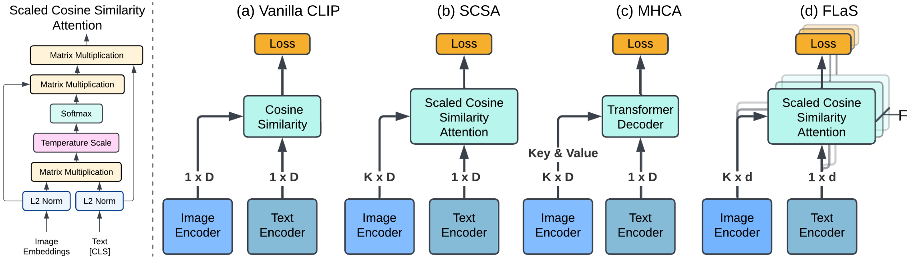
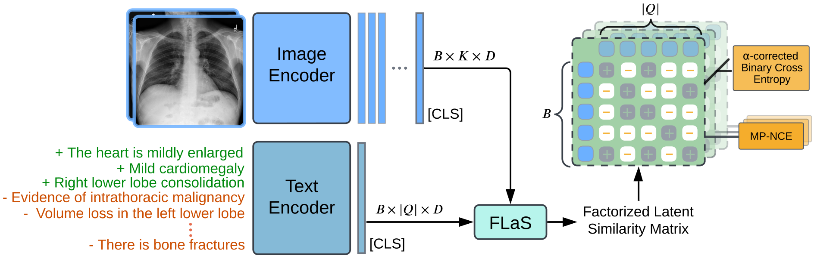
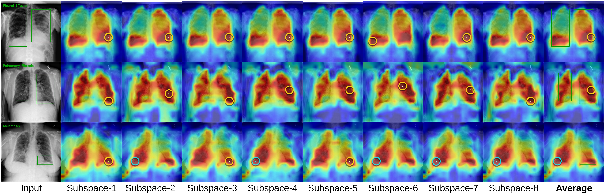
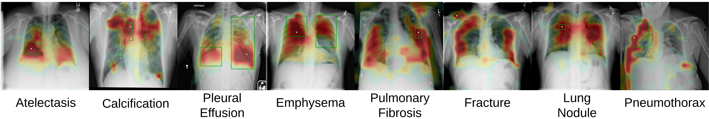
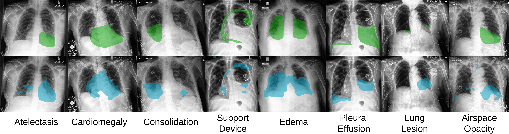

<h1 align="center">AlphaRAD: Grounded Zero-Shot Classification in Chest Radiology via α-Corrected Binary Cross Entropy and Factorized Latent Supervision</h1>

<p align="center">
  <strong><font size="+2">🌐 <a href="https://jz5426.github.io/AlphaRAD/">Project Page</a> • 📝 <a href="https://arxiv.org/abs/2609.01757">Paper</a> • 🤗 <a href="https://huggingface.co/maxxyouu/AlphaRAD">Models</a> • 🧩 <a href="https://github.com/jz5426/ECCV-2026-AlphaRAD">Code</a></font></strong>
</p>

## Main Ideas
<p align="center">
  
  <br>
  <em>Figure 1. Type of cross-modal feature fusion in medical VLPMs. (a) Vanilla CLIP style fusion with limited capability in zero-shot grounding and segmentation. (b) SCSA fusion-based medical VLPM. (c) MHCA fusion-based medical VLPM. (d) FLaS, our proposed feature fusion module, introduces no additional parameter overhead compared to (b) and (c). K is the number of image embeddings. D is the feature dimension. D = d × F, where F is the number of factorized latent spaces.</em>
</p>

<p align="center">
  
  <br>
  <em>Figure 2. Overall framework of AlphaRad in training. Details of FLaS are shown in Figure 1. B is the batch size. Q denotes the shared set of medical concepts sampled for the batch, but each image has a different set of positive and negative concepts. K is the number of image embeddings. D is the hidden dimension. Green text (+) indicates positive concepts and orange text (-) indicates sampled negative concepts.</em>
</p>


<p align="center">
  
  <br>
  <em>Figure 3. Illustration of the factorized latent subspaces in FLaS. Yellow circle is a correct hit and cyan circle for a incorrect hit are manually created to draw the reader's attention to the peak point predicted by FLaS. Ground truth bounding boxes are colored in olive green.</em>
</p>

<p align="center">
  
  <br>
  <em>Figure 4. Randomly selected similarity maps derived from FLaS on ChestXDet10 for the positive cases. Yellow dot indicates the pixel with the highest attention intensity.</em>
</p>

<p align="center">
  
  <br>
  <em>Figure 5. Representative predicted masks from FLaS on CheXlocalize. For each disease the sample with the Dice score closest to the class mean is presented. Olive green indicates ground truth mask and cyan indicates predictions.</em>
</p>


## Abstract

> Vision-Language Pretrained Models (VLPMs) offer a scalable path to open-vocabulary chest radiology understanding, yet two aspects remain underexplored: how structured clinical semantics extracted from medical reports can reduce in-batch noise during contrastive learning, and how cross-modal fusion can be designed to produce more faithful spatial grounding without added complexity. We introduce AlphaRad, addressing these opportunities through two contributions. First, we construct a large-scale structured medical concept space from medical reports parsed by a Large Language Model for training, thereby mitigating in-batch learning noise and removing heuristic pair matching in contrastive learning, and thus naturally positioning AlphaRad as a medical concept discriminator trained via α-Corrected Binary Cross-Entropy. Second, we propose FLaS (Factorized Latent Supervision), an extremely simple yet effective cross-modal feature fusion module that factorizes VLPM representations into independent subspaces, using dedicated alignment supervision to enhance the expressiveness of spatial grounding without introducing additional model parameters. Through extensive empirical validation, AlphaRad shows strong zero-shot generalization across diverse chest radiology tasks. Notably, it establishes state-of-the-art average performance across 16 classification benchmarks, while achieving individual state-of-the-art results via distinct gains on 7 grounding/phrase grounding and 3 segmentation datasets.

## Updates

- 📣 **[June 2026]** The paper has been accepted by ECCV 2026！

## TODO
- [x] Release the paper on arXiv.
- [x] Release a model checkpoint in huggingface.
- [x] Release sample evaluation code.
- [x] Release sample test data.
- [x] Release the official repository.

## Environment Installation

We use [uv](https://docs.astral.sh/uv/) for environment and dependency management.

```bash
# Install uv, if you don't have it
curl -LsSf https://astral.sh/uv/install.sh | sh

git clone https://github.com/jz5426/ECCV-2026-AlphaRAD.git
cd ECCV-2026-AlphaRAD

# Create the environment and install locked dependencies
uv sync
```

`uv sync` creates a `.venv/` in the project root and installs the pinned versions from `uv.lock`. Run commands through `uv run` to use that environment without activating it:

Or activate it directly:

```bash
source .venv/bin/activate
```

## Cache Path Configuration

Before running evaluation, you must set the local cache paths for the pretrained text and image encoder weights in [cxrclip/evaluator.py](cxrclip/evaluator.py#L20-L22):

```python
ckpt['config']['model']['text_encoder']['cache_dir'] = '/path/to/text_encoder_cache'
ckpt['config']['model']['image_encoder']['cache_dir'] = '/path/to/image_encoder_cache'
```

- `text_encoder['cache_dir']`: download and set path to the local directory containing the [MPNetV2](https://huggingface.co/sentence-transformers/all-mpnet-base-v2) weights.
- `image_encoder['cache_dir']`: download and path to the local directory containing the [XrayDINOv2](https://huggingface.co/StanfordAIMI/dinov2-base-xray-224) image encoder weights.

These overrides are applied immediately after the checkpoint is loaded, so the model uses your local cache rather than attempting a network download.

## Test Data Curation

Representative evaluation CSV files are provided under [configs/data_csv/](configs/data_csv/) and their corresponding dataset configuration files under [configs/data_test/](configs/data_test/). The examples span three evaluation categories:

| Task | Dataset | CSV file | Config file |
|------|---------|----------|-------------|
| Classification | CheXpert | `configs/data_csv/chexpert.csv` | `configs/data_test/chexpert.yaml` |
| Classification | Covid-Kaggle | `configs/data_csv/covidkaggle.csv` | `configs/data_test/covidkaggle.yaml` |
| Grounding | ChestX-Det10 | `configs/data_csv/chestXDet10_gt.csv` | `configs/data_test/chestXDet10_gt.yaml` |
| Segmentation | CheXlocalize | `configs/data_csv/chestXlocalize_seg.csv` | `configs/data_test/chexlocalize_seg.yaml` |
| Segmentation | QaTa-COV19 | `configs/data_csv/qatacov19.csv` | `configs/data_test/qatacovid_seg.yaml` |

The `image` column in every CSV contains paths relative to the dataset root (prefixed with `...`). Update these paths to match your local file system before running evaluation.

### Image Format Conversion

Some datasets distribute images in formats other than PNG/JPEG. For these, convert the images to PNG first using the utilities in [cxrclip/data/dataformat_converter.py](cxrclip/data/dataformat_converter.py):

- **DICOM (`.dcm`)** — use `resize_dicom_and_save()`, which applies modality LUT, VOI windowing, and optional photometric inversion before saving as PNG:
  ```python
  from cxrclip.data.dataformat_converter import resize_dicom_and_save
  resize_dicom_and_save(load_path="image.dcm", save_path="image.png")
  ```

- **MHA (`.mha`, e.g. Node21)** — use `resize_mha_and_save()`, which reads via SimpleITK and normalises the pixel values before saving as PNG. Note that DICOM-specific windowing steps are intentionally omitted as Node21 images are already pre-processed:
  ```python
  from cxrclip.data.dataformat_converter import resize_mha_and_save
  resize_mha_and_save(load_path="image.mha", save_path="image.png")
  ```

Set `do_resize=True` to additionally resize the image so that its shortest side is 512 pixels (Lanczos interpolation). Once converted, update the `image` column in the corresponding CSV to point to the PNG files.

### Disease Label Registry

Each dataset must have a corresponding disease label list registered in [cxrclip/prompt/constants.py](cxrclip/prompt/constants.py). At evaluation time, `get_class_list` in [cxrclip/evaluator_utils.py](cxrclip/evaluator_utils.py) resolves the label list by calling `getattr(constants, dataset_name.upper())`, where `dataset_name` is the value of the `name` field in the dataset's YAML configuration file. Concretely, a dataset whose YAML contains `name: "chexpert"` must have a variable named `CHEXPERT` defined in `constants.py`.

The five provided datasets are already registered:

| YAML `name` field | `constants.py` variable |
|-------------------|------------------------|
| `chexpert` | `CHEXPERT` |
| `covidkaggle` | `COVIDKAGGLE` |
| `chestxdet10_gt` | `CHESTXDET10_GT` |
| `chexlocalize_seg` | `CHEXLOCALIZE_SEG` |
| `qatacovid_seg` | `QATACOVID_SEG` |

When adding a new dataset, define its `name` field in the YAML and add the corresponding uppercase variable to `constants.py` before running evaluation.

### Expected CSV Format

**Classification** (`chexpert.csv`, `covidkaggle.csv`)

| Column | Type | Description |
|--------|------|-------------|
| `image` | `str` | Path to the image file |
| `label` | `list[int]` | Multi-hot binary vector over the label vocabulary; scalar `0`/`1` for binary datasets |
| `class` | `list[str]` or `str` | Human-readable name(s) of the positive class(es) |

**Grounding/Phrase Grounding** (`chestXDet10_gt.csv`)

| Column | Type | Description |
|--------|------|-------------|
| `image` | `str` | Path to the image file |
| `class` | `list[str]` | Name(s) of the disease present in grounding datasets or the finding phrase like `Small left apical pneumothorax` for phrase-grounding datasets |
| `boxes` | `list[list[int]]` | Bounding boxes in `[x1, y1, x2, y2]` pixel coordinates (one entry per instance) |
| `label (optional)` | `list[int]` | Multi-hot binary vector over the 10-class label vocabulary |
| `<class_name> (optional)` | `int` | One binary column per class (e.g. `Effusion`, `Nodule`) for convenient per-class filtering |

**Segmentation** (`chestXlocalize_seg.csv`, `qatacov19.csv`)

| Column | Type | Description |
|--------|------|-------------|
| `image` | `str` | Path to the image file |
| `class` | `list[str]` | Name(s) of the disease present |
| `EncodedPixels` | `list[str]` | Run-length encoded (RLE) mask in the format `start length start length …`, one string per class instance |
| `label (optional)` | `float` | Binary label (`0.0` / `1.0`) indicating presence of disease |

## Model Evaluation/Inference

AlphaRad performs **zero-shot classification / grounding / phrase grounding / segmentation for chest X-ray** using the **AlphaRad model** on 🤗 [Hugging Face](https://huggingface.co/maxxyouu/AlphaRAD).

The entry point is [evaluate_zeroshot.py](evaluate_zeroshot.py), configured via [configs/eval_zeroshot.yaml](configs/eval_zeroshot.yaml). Launch evaluation with:

```bash
python evaluate_zeroshot.py
```

The evaluation pipeline works as follows:

1. **Configuration** — `eval_zeroshot.yaml` declares which datasets to evaluate (listed under `defaults.data_test`), the dataloader settings, and the path(s) to one or more model checkpoints under `test.checkpoint`. Checkpoint paths may be a list, a directory (all `.tar` files are globbed), or a glob pattern.
2. **Model loading** — `Evaluator` loads each checkpoint, overrides the encoder cache paths (see [Cache Path Configuration](#cache-path-configuration)), and builds the model from the config stored inside the checkpoint, ensuring full compatibility between the weights and the architecture.
3. **Zero-shot evaluation** — For every (checkpoint, dataset) pair, `evaluate_clip_offline` computes similarity scores between image embeddings and text prompts derived from the disease label list in `constants.py`. No task-specific fine-tuning is performed.
4. **Task-specific scoring** — Results are automatically dispatched to the appropriate metric based on the dataset name:
   - **Classification** (e.g. `chexpert`, `covidkaggle`): AUROC per class and macro average.
   - **Grounding/Phrase Grounding** (e.g. `chestxdet10_gt`): Pointing Game accuracy — whether the highest-attention pixel falls within the ground-truth bounding box (macro average for all diseases for grounding and flat average for phrase grounding).
   - **Segmentation** (e.g. `chexlocalize_seg`, `qatacovid_seg`): Dice score against RLE-encoded ground-truth masks.
5. **Output** — Per-dataset results are logged to the console and to `eval_outputs/<date>/<time>/evaluate.log` (controlled by the Hydra logging config in `eval_zeroshot.yaml`).

## Evaluation Results

The following tables report zero-shot performance across all benchmarks presented in the paper, evaluated using the provided checkpoint with pretrained backbones `XrayDINOv2 + MPNetV2`. These numbers serve as reference values to verify that your environment and path configurations are set up correctly. Metrics are AUROC for classification, Pointing Game for grounding/phrase grounding, and Dice for segmentation datasets.

Note that the results below may differ slightly from those in the paper, with most differences yielding **slightly better numbers**. The original checkpoint was inadvertently lost and subsequently retrained; any variation is due to hardware non-determinism during training. Nonetheless, **all conclusions drawn in the paper remain valid**.

### Zero-Shot Classification

| Res. | CXD | CXP | CX14 | CXP5 | VCXR | CLT2 | CLT3 | PAD | CSLV | CDLV | CCOM | RSNA | SIIM | SZX | MONT | COVK | Avg |
|------|-----|-----|------|------|------|------|------|-----|------|------|------|------|------|-----|------|------|-----|
|  518 | 79.7| 89.3| 80.8 |   76.0   |  92.4    |  81.3    |  73.0    |  87.3   |  70.3    |  76.9    | 73.2     | 84.1     |  94.8    |  95.5   |  97.5    |  89.6    |  83.9   |

### Zero-Shot Grounding / Phrase Grounding / Segmentation

<table>
  <thead>
    <tr>
      <th rowspan="2">Res.</th>
      <th colspan="5" align="center">Grounding</th>
      <th colspan="4" align="center">Phrase Grounding</th>
      <th colspan="4" align="center">Segmentation</th>
    </tr>
    <tr>
      <th>CXD</th><th>VCXR</th><th>CXL</th><th>ND21</th><th>Avg</th>
      <th>MSC1</th><th>MSC2</th><th>PCGR</th><th>Avg</th>
      <th>CXL</th><th>SIIM</th><th>QTCV</th><th>Avg</th>
    </tr>
  </thead>
  <tbody>
    <tr>
      <td>518</td>
      <td>66.9</td><td>55.4</td><td>64.4</td><td>52.6</td><td>59.8</td>
      <td>90.4</td><td>70.8</td><td>74.3</td><td>78.5</td>
      <td>48.9</td><td>22.9</td><td>52.3</td><td>41.4</td>
    </tr>
  </tbody>
</table>

## References

- **Training Dataset**

  - [MIMIC-CXR](https://physionet.org/content/mimic-cxr/2.1.0/)

- **Evaluation Datasets**
  - [ChestXDet10](https://github.com/Deepwise-AILab/ChestX-Det10-Dataset)
  - [CheXpert](https://stanfordmlgroup.github.io/competitions/chexpert/)
  - [NIH14](https://www.kaggle.com/datasets/nih-chest-xrays/data)
  - [CheXpert 5x200](https://stanfordmedicine.app.box.com/s/j5h7q99f3pfi7enc0dom73m4nsm6yzvh)
  - [VinDr-CXR](https://physionet.org/content/vindr-cxr/1.0.0/)
  - [CXR-LT Task 2 and 3](https://physionet.org/content/cxr-lt-iccv-workshop-cvamd/2.0.0/)
  - [PadChest](https://bimcv.cipf.es/bimcv-projects/padchest/)
  - [CheXchoNet SLVH, DLV, and Composite](https://physionet.org/content/chexchonet/1.0.0/)
  - [RSNA pneumonia](https://www.rsna.org/artificial-intelligence/ai-image-challenge/rsna-pneumonia-detection-challenge-2018)
  - [SIIM pneumothorax](https://www.kaggle.com/c/siim-acr-pneumothorax-segmentation)
  - [Shenzhenxray](https://openi.nlm.nih.gov/imgs/collections/ChinaSet_AllFiles.zip)
  - [Montegomory](https://data.lhncbc.nlm.nih.gov/public/Tuberculosis-Chest-X-ray-Datasets/Montgomery-County-CXR-Set/MontgomerySet/index.html)
  - [Covid Kaggle](https://ieeexplore.ieee.org/document/9144185)
  - [Chexlocalize](https://aimi.stanford.edu/datasets/chexlocalize)
  - [Nodule21](https://node21.grand-challenge.org/)
  - [MS-CXR v1 and v2](https://physionet.org/content/ms-cxr/1.1.0/)
  - [PadChest-GR](https://ai.nejm.org/doi/full/10.1056/AIdbp2401120)
  - [QaTa-COV19](https://www.kaggle.com/datasets/aysendegerli/qatacov19-dataset)

## Acknowledgments

Jianzhong You is funded by the Ontario Graduate Scholarship–Doctoral. Yuan Gao holds a CIHR Canada Graduate Scholarship–Doctoral. Dr. Chris McIntosh holds the Chair in Medical Imaging at the Joint Department of Medical Imaging at University Health Network and University of Toronto.

## Citation

```bibtex
@misc{you2026alpharad,
      title={AlphaRAD: Grounded Zero-Shot Classification in Chest Radiology via $\alpha$-Corrected Binary Cross Entropy and Factorized Latent Supervision}, 
      author={Jianzhong You and Yuan Gao and Chris McIntosh},
      year={2026},
      eprint={2609.01757},
      archivePrefix={arXiv},
      primaryClass={cs.CV},
      url={https://arxiv.org/abs/2609.01757}, 
}
```